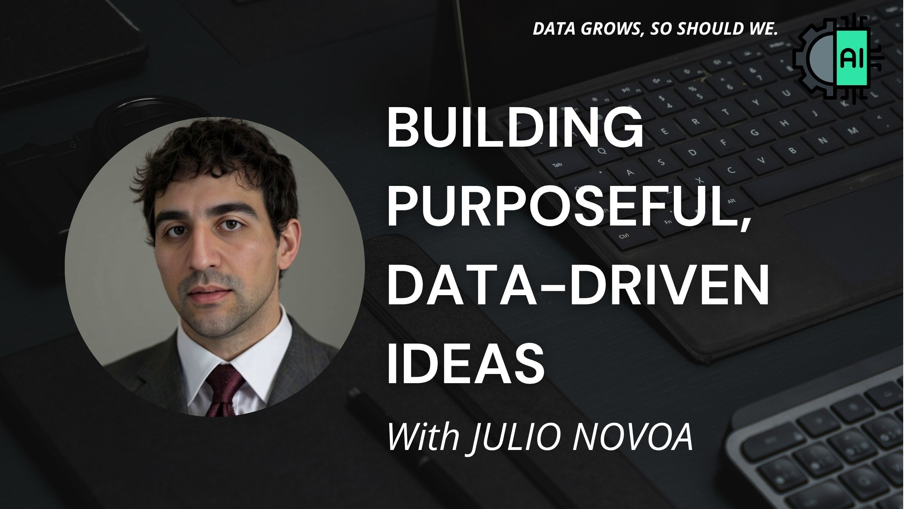

<h2>Hey there! I'm Julio</h2>

<!-- ## 👋 &nbsp;Hola a Todos!  Mi nombre es Julio -->

### 👨🏻‍💻 &nbsp;About Me

💡  I'm passionate about turning data into decisions. I enjoy uncovering patterns, solving real-world problems, and building applied solutions using R, Tableau, and Python.

📊  Currently focused on data analysis, effective storytelling through visualization, and exploring AI applications in personal growth, business strategy, and social impact.

🌱  I constantly explore new technologies and methods to optimize processes and drive results—especially in high-impact environments.

🎥  I also create educational and motivational content on YouTube, combining Stoic philosophy, strategic thinking, and historical warriors to inspire and empower others.

✍️  Deeply interested in the intersection of technology, human purpose, and critical thinking. Always open to collaborative projects, consulting, or thought-provoking conversations.

📩  Feel free to reach out at [julio.novoa.jeria@gmail.com] — I always respond to messages with intention.

📄  Check out my résumé or portfolio for more details. Feedback and new ideas are always welcome!

---

**🧠 Pila tecnológica**

  
  
  
  
  
  
  
  

